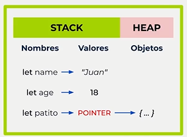
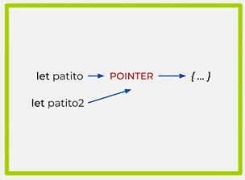
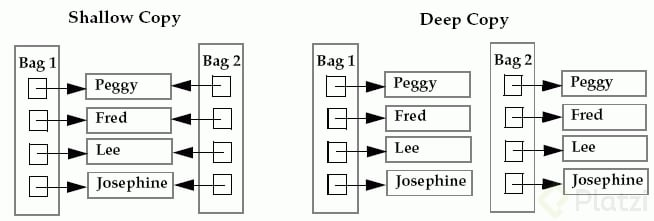

# POO en JavaScript

*Curso Intermedio* por ***Juan David Castro*** - *Platzi 2022*

Explora cómo funcionan los objetos en JavaScript a profundidad. Descubre cómo copiar, identificar y encapsular elementos con objetos literales, prototipos o clases. Comprende cómo funciona la memoria de los navegadores web y cómo aprovechar el sistema de herencia en objetos con la propiedad proto. 

- Copia objetos de JavaScript con shallow y deep copy
- Comprende cómo funciona la memoria en JavaScript
- Pon en práctica los métodos estáticos de Object
- Aplica el paradigma orientado a objetos sin clases ni prototipos

## Introducción

### 1. ¿Qué hay dentro de los objetos en JavaScript?

Requisitos:

- Closure y Scope
- Fundamentos POO
- POO básico en JS

## Profundicemos en Objetos

 ### 2. Static: atributos y métodos estáticos en JavaScript

Hasta ahora habíamos aprendido que apara acceder a los métodos o atributos de una clase o prototipo teníamos que crear una instancia del prototipo(Objeto). Pero hay una forma de que podemos saltarnos tener que crear una instancia del prototipo para acceder a los métodos o atributos, esta es la forma **Static**

Para crear atributos estáticos los cuales podamos acceder sin crear un objeto o una instancia de este prototipo, solo hay que agregar al atributo la palabra `static`

```js
class Animal {
    static sound = 'croack!';
}
//acceder al atributo sin crear una instancia
console.log(animal.sound);
//croack!
```

De la misma forma podemos hacer con los métodos:

```js
class Animal {
    static makeSound(){
        return 'croack!';
    }
}
//acceder al método
console.log(Animal.makeSound());
//croack!
```

#### Métodos estáticos del prototipo Object

Tenemos el objeto *person*, el cual tiene atributos, haciendo uso de los métodos estáticos de **Object** podemos acceder a los atributos de nuestro objeto *person*:

```js
const person = {
    name: 'Tim',
    email: 'tim@mail.com',
    age: 18,
}
```

`Object.keys()`

Nos devuelve un array con los nombres clave de nuestro objeto.

```js
Object.keys(person);
//["name", "email", "age"]
```

`Object.values()`

Podemos acceder a los valores de los atributos

```js
Object.values(person);
//["Tim", "tim@mail.com", 18]
```


`Object.getOwnPropertyNames()`

También devuelve un array de los nombres clave.

```js
Object.getOwnPropertyNames(person);
//["name", "email", "age"]
```

`Object.entries()`

Nos devuelve un array que contiene arrays por cada uno de los atributos, que contiene la clave y el valor del atributo.

```js
Object.entries(person);
/*
[
	0: (2) ['name', 'Tim'],
	1: (2) ['email', 'tim@mail.com'],
	2: (2) ['age', 18]
]
*/
```

`Object.getOwnPropertyDescriptors()`

Nos devuelve un objeto, el cual contiene un objeto por cada atributo, este objeto nos describe al atributo con su valor y otras características adicionales.

```js
Object.getOwnPropertyDescriptors(person);
/*
{
    age: {
        value: 18, 
        writable: true, 
        enumerable: true, 
        configurable: true
    },
    email: {
        value: 'tim@mail.com', 
        writable: true, 
        enumerable: true, 
        configurable: true
    },
    name: {
    	value: 'Tim', 
    	writable: true, 
    	enumerable: true, 
    	configurable: true
    	}
}
*/

```

#### Encapsulamiento

Si recordamos del curso anterior, el objetivo del encapsulamiento es limitiar quien puede modificar, acceder o ejecutar nuestros metodos o atributos de la clase o prototipo.

Ahora con las propiedades **writable, configurable, enumerable** podemos limitar quien tiene acceso, modificar nuestros objetos.

 ### 3. Métodos estáticos del prototipo Object

Al “desconponer” el objeto con Object.entries y al producir una array de arrays con los atributos y metodos del objeto, el ambito lexico cambia y por ende la palabra reservada **this** funciona en un contexto diferente al inicial.

```js
const juan = {
    name: 'Juan',
    age: 18,
    approvedCourses: ['Java', 'JavaScript'],
    addCourse(newCourse){
        console.log('This: ', this);
        console.log(this.approvedCourses);
        this.approvedCourses.push(newCourse);
    },
};

console.log(Object.keys(juan));
console.log(Object.values(juan));
console.log(Object.getOwnPropertyNames(juan));
//Si tratamos de acceder al método addCourse usando entries
//Nos dará error, ya que en ese caso this.approvedCourses
//Ya no hace referencia a juan, sino al array que contiene los entries
console.log(Object.entries(juan));
juan.addCourse('GoLang');
//este código no funcionará
//this.approvedCourses será undefined
Object.entries(juan)[3][1]('PHP');


console.log(Object.getOwnPropertyDescriptors(juan));

//Object.defineProperty(obj, prop, descriptor)
//obj, es el objeto sobre el cual se define la propiedad
//prop, nombre de la propiedad definida o modificada
//descriptor, es de la propiedad que esta siendo definida
Object.defineProperty(juan, 'pruebaNasa', {
    value: 'Extraterrestres',
    enumerable: true,
    writable: true,
    configurable: true,
});

console.log(Object.getOwnPropertyDescriptors(juan));
```

> Mas información sobre Object: [Object MDN Mozilla](https://developer.mozilla.org/en-US/docs/Web/JavaScript/Reference/Global_Objects/Object)

 ### 4. Object.defineProperty

El  método estático `Object.defineProperty()` define una nueva propiedad sobre un objeto, o modifica una ya existente, y devuelve el objeto modificado.

Sintaxis: `Object.defineProperty(obj, prop, descriptor)`

`obj`: Objeto sobre el cual se define la propiedad

`prop`: El nombre de la propiedad a ser definida o modificada

`descriptor`: El descriptor de esa propiedad que está siendo definida o modificada

Este método nos permite modificar el comportamiento por defecto de las propiedades. Es decir, nos permite definir una propiedad como no enumerable, no modificable o incluso evitar que pueda ser eliminada del objeto.

`configurable`

`true` si y solo si el tipo de descriptor de propiedad puede modificarse y si la propiedad puede ser eliminada del correspondiente objeto.

`enumerable`

`true` si y solo si dicha propiedad se muestra durante la enumeración de las propiedades del objeto correspondiente.

Un descriptor de datos tiene además las siguientes claves opcionales:

`value`

El valor asociado a la propiedad. Puede ser cualquier tipo valido de JavaScript (number, object, function, etc). **Por defecto es `undefined`.**

`writable`

`true` Indica si el valor de la propiedad puede modificarse con el [operador de asignación.

```javascript
const juan = {
    name: 'Juan',
    age: 18,
    approvedCourses: ['Java', 'JavaScript'],
    addCourse(newCourse){
        console.log('This: ', this);
        console.log(this.approvedCourses);
        this.approvedCourses.push(newCourse);
    },
};

//enumerable:false, No sera visible con Object.keys()
//Object.getOwnPropertyNames() si muestra la propiedad
//writable: false, no nos permite editar el value
//configurable:false, no permite borrar la propiedad

Object.defineProperty(juan, 'pruebaNasa', {
    value: 'Extraterrestres',
    enumerable: false,
    writable: false,
    configurable: false,
});

//Object.keys() no lo mostrará, no es enumerable
//Object.getOwnProperyNames(), si aparecen
Object.defineProperty(juan, 'navigator', {
    value: 'Chrome',
    enumerable: false,
    writable: true,
    configurable: true,
});

//No nos permite cambiar el value de la propiedad
//Pero si lo podemos borrar
Object.defineProperty(juan, 'editor', {
    value: 'VSCode',
    enumerable: true,
    writable: false,
    configurable: true,
});

//No se puede borrar el atributo, pero si se puede
//modificar el value:
Object.defineProperty(juan, 'terminal', {
    value: 'Bash',
    enumerable: true,
    writable: true,
    configurable: false,
});

console.log(Object.getOwnPropertyDescriptors(juan));
```

`Object.seal()`

Previene que otro código pueda borrar propiedades de un objeto.

`Object.freeze()`

Congela un objeto. Otro código **no puede borrar** ***ni cambiar*** sus propiedades. Tampoco puede agregar propiedades.

```js
//Cambia configurable a false
//no permite borrar las propiedades
Object.seal(juan);

//cambia configurable y writable a false
//no permite editar ni borrar las propiedades
Object.freeze(juan);
```

## Cómo copiar objetos en JavaScript

 ### 5. Cómo funciona la memoria en JavaScript





🎳 Las variables son referencias a un espacio en memoria.
🎩 Los navegadores web usan dos tipos de memorias: **Stack** y **Heap**.
📁 La memoria Stack es muy rápida, pero sin tanto espacio. Aquí se guardan los valores primitivos (booleanos, strings, números…).
🌪 La memoria Heap es más lenta, pero permite guardar enormes cantidades de información *(son como los tornados: grandes, lentos y desordenados)*. En esta memoria guardamos los valores de los objetos `({...}`)

Entender cómo funciona la memoria en JavaScript no solo será útil para aprender POO, sino también para programación funcional. 

 ### 6. Shallow copy en JavaScript

El **Shallow Copy** *(copia superficial)* es una copia bit a bit de un objeto. Se crea un nuevo objeto que tiene una copia exacta de los valores del objeto original. Si alguno de los campos del objeto son referencias a otros objetos, solo se copian las direcciones de referencia, es decir, solo se copia la dirección de memoria.



Como resultado, cuando se modifica el objeto copiado o la copia, se pueden causar modificaciones inesperadas en el otro objeto.

```javascript
const obj1 = {
    a: 'a',
    b: 'b',
    c: {
        d: 'd',
        e: 'e',
    }
}

//shallow copy del objeto 1 con ciclo for
const obj2 = {};
for (prop in obj1){
    obj2[prop] = obj1[prop];
}

//shallow copy usando Object.assign
const obj3 = Object.assign({}, obj1);

//shallow copy usando Object.create
const obj4 = Object.create(obj1);

//shallow copy con spread operator
const obj5 = {...obj1};
```

En todos los casos mostrados, en el primer nivel al modificar la propiedad a y b el alguno de los objetos, no afecta al otro, sin embargo en c, tenemos un objeto dentro del objeto, en ese caso al hacer las modificaciones de las propiedades d y e del objeto 2, 3 y 4, en realidad se está modificando el objeto 1, en las copias de los objetos solo estaría copiándose la referencia del objeto en c del objeto 1.

 ### 7. Qué son JSON.parse y JSON.stringify

#### JSON.stringify()

El método `JSON.stringify()` convierte un objeto o valor de JavaScript en una cadena JSON, reemplazando opcionalmente valores si se especifica una función de reemplazo u opcionalmente incluyendo solo las propiedades especificadas si se especifica una matriz de reemplazo.

- Descripción
  - Los objetos Boolean, Number, and String se convierten a sus valores primitivos, de acuerdo con la conversión semántica tradicional.
  - Si durante la conversión se encuentra un undefined, una Function, o un Symbol se omite (cuando se encuentra en un objeto) o se censura a null (cuando se encuentra en un array). JSON.stringify() puede devolver undefined cuando se pasan valores “puros” como JSON.stringify(function(){}) o JSON.stringify(undefined).
  - Todas las propiedades que utilicen Symbol en los nombres de la clave se ignoran por completo, incluso si utilizan una función replacer.
  - Las instancias de Date implementan la función toJSON() devolviendo una cadena de texto (igual que date.toISOString()). Por lo que son tratadas como strings.
  - Los números Infinity y NaN, así como el valor null, se consideran null.
    El resto de instancias de Object (incluyendo Map, Set, WeakMap, y WeakSet) sólo tendrán serializadas sus propiedades enumerables.

JSON.stringify () convierte un valor en notación JSON que lo representa.

#### JSON.parse()

El método `JSON.parse()` analiza una cadena de texto (string) como JSON, transformando opcionalmente el valor producido por el análisis.
Porqué JSON.parse(JSON.stringify()) es una mala práctica para clonar un objeto en JavaScript.

- Puedes perder tipos de datos.
- JavaScript no te avisara cuando pierdas algún tipo de dato al usar JSON.stringify().
- Convierte tipos de datos no soportados en soportados, como infinity y NaN en null
- Los tipos de datos Date serán parseados como strings, no como Date
- No es tan rápido y eficiente.

```js
const obj1 = {
    a: 'a',
    b: 'b',
    c: {
        d: 'd',
        e: 'e'
    },
    editA(){
        this.a = 'AAAAAA';
    }
}

//se guarda en la memoria Stack
//No trabaja con métodos, los omite
const stringifiedComplexObj = JSON.stringify(obj1);
//'{"a":"a","b":"b","c":{"d":"d","e":"e"}}'

//la copia ya no hace referencia al objeto 1
//Este objeto no tendrá el metodo de obj1
//Sin embargo se soluciona el problema con los objetos
const obj2 = JSON.parse(stringifiedComplexObj);
```

> No saben trabajar con métodos o funciones.

## Recursividad en JavaScript

 ### 8. Qué es recursividad
 ### 9. Deep copy con recursividad

## Abstracción y encapsulamiento sin prototipos

 ### 10. Abstracción con objetos literales y deep copy
 ### 11. Factory pattern y RORO
 ### 12. Module pattern y namespaces: propiedades privadas en JavaScript
 ### 13. Getters y setters

## Como identificar Objetos

 ### 14. Qué es duck typing
 ### 15. Duck typing en JavaScript
 ### 16. Instance Of en JavaScript con instancias y prototipos
 ### 17. Atributos y métodos privados en prototipos
 ### 18. Creando métodos estáticos en JavaScript

## Próximos pasos

 ### 19. ¿Quieres más cursos de POO en JavaScript?

